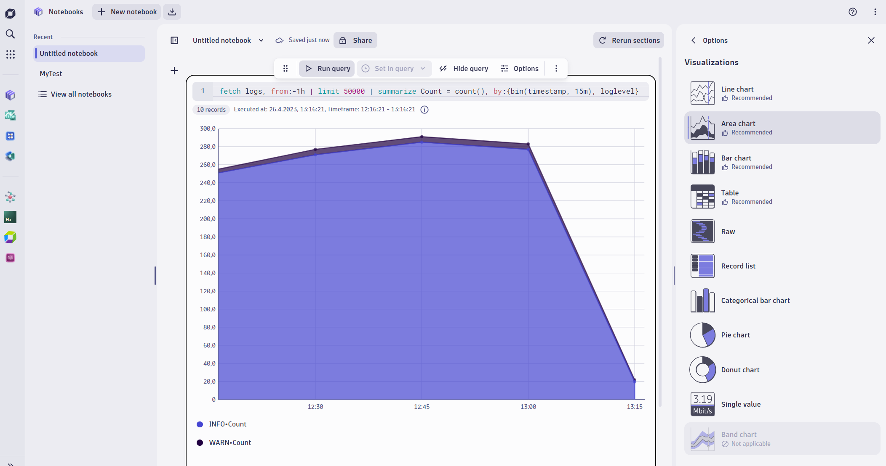
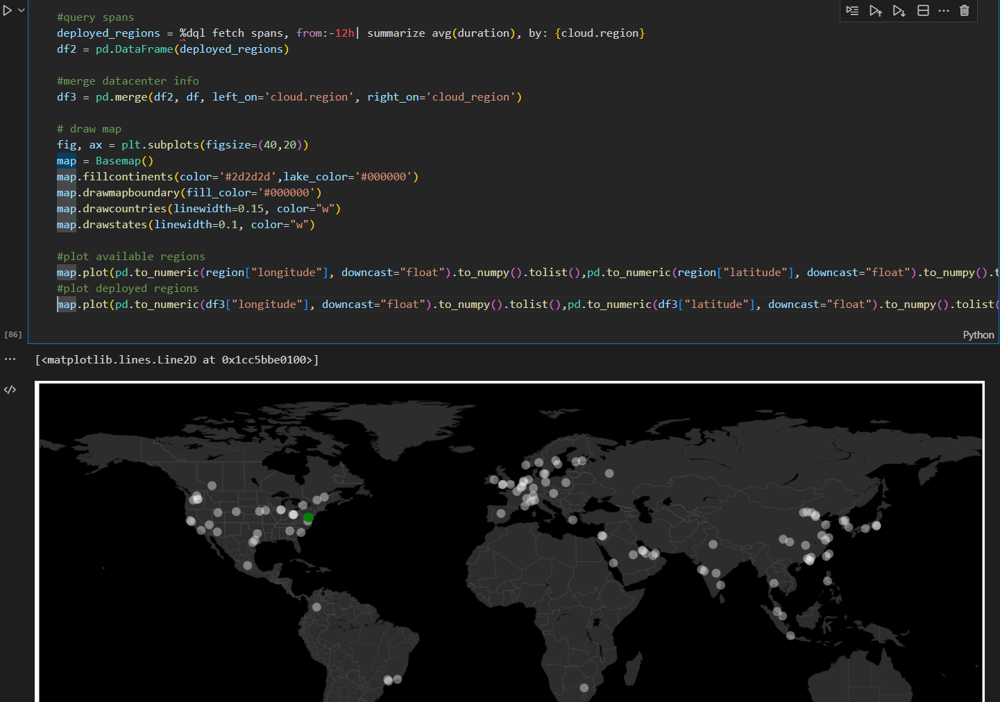

# Dqlmagic

Dqlmagic is an IPython [magic function](https://jakevdp.github.io/PythonDataScienceHandbook/01.03-magic-commands.html) allowing to use DQL in your [Jupyter notebooks](https://jupyter.org/).

[Dynatrace Query Language (DQL)](https://www.dynatrace.com/support/help/platform/grail/dynatrace-query-language) is a powerful tool to explore your data and discover patterns, identify anomalies and outliers, create statistical modeling, and more based on data stored in Dynatrace Grail storage. 

While the Dynatrace platform provides an OOTB support for notebooks with an easy to use, integrated support for writing DQL queries with intellisense, DAVIS AI powered analysis of results as well as OOTB visuzalizations... 



... using DQL in Jupyter notebooks opens up a huge toolbox and community for data-scientists for specialized analysis and engineers to prototype use-cases and Dynatrace Apps. 

### Example - Analyze cloud region usage, plotting public cloud regions (external data-source) on a world-map VS used cloud-regions based.



## Available magic functions

### dql <dql_query>
Allows to run a DQL query and returns the response records as json array.

Available as inline and cell function. 

### dql_raw <dql_query>
Allows to run a DQL query and returns the response in raw json format as provided by the api.

Available as inline and cell function. 

### auth_grail <config_prefix>
Inline function connecting to the grail cluster. 

Reads connection parameters from .env file: 
```
dt_oauth_url="https://sso.dynatrace.com/sso/oauth2/token"

dt_oauth_clientid="<YOUR-CLIENT-ID>"
dt_oauth_clientsecret="<YOUR-CLIENT-SECRET>"
dt_oauth_scope="<YOUR-ACCESS-SCOPE>"

dt_tenant="<YOUR-TENANT-ID>"
grail_apiurl="https://<YOUR-TENANT-ID>.live.dynatrace.com/api/v2/dql/query"
```

The ```<config_prefix>``` is **optional** to be used if you have multiple configs stored in your .env file like e.g. 

```
dt_config_prefix="DEV"

DEV_dt_oauth_url="https://sso.dynatrace.com/sso/oauth2/token"
DEV_dt_oauth_clientid="<YOUR-DEV-CLIENT-ID>"
DEV_dt_oauth_clientsecret="<YOUR-DEV-CLIENT-SECRET>"
DEV_dt_oauth_scope="<YOUR-DEV-ACCESS-SCOPE>"
DEV_dt_tenant="<YOUR-DEV-TENANT-ID>"
DEV_grail_apiurl="https://<YOUR-DEV-TENANT-ID>.apps.dynatracelabs.com/platform/storage/query/v1/"

PROD_dt_oauth_url="https://sso.dynatrace.com/sso/oauth2/token"
PROD_dt_oauth_clientid="<YOUR-PROD-CLIENT-ID>"
PROD_dt_oauth_clientsecret="<YOUR-PROD-CLIENT-SECRET>"
PROD_dt_oauth_scope="<YOUR-PROD-ACCESS-SCOPE>"
PROD_dt_tenant="<YOUR-PROD-TENANT-ID>"
PROD_grail_apiurl="https://<YOUR-PROD-TENANT-ID>.apps.dynatracelabs.com/platform/storage/query/v1/"

```

With the parameter ```dt_config_prefix```, you set the default config prefix used, if %auth_grail parameter ```<config_prefix>``` is not provided.

For more details on how to setup API oauth clients in Dynatrace see [Configure and manage account API OAuth clients
](https://www.dynatrace.com/support/help/how-to-use-dynatrace/account-management/identity-access-management/account-api-oauth)

For more details on .env file see [How to NOT embedded credential in Jupyter notebook](https://yuthakarn.medium.com/how-to-not-show-credential-in-jupyter-notebook-c349f9278466) or [python-dotenv](https://pypi.org/project/python-dotenv/)

## Install Dqlmagic

Checkout the repository and install using following command. 

```
pip install dqlmagic
```

## Load Dqlmagic within your notebook

```
%reload_ext dqlmagic
```

## Getting Started

If you are new to Jupyter notebooks, I recommend getting started using [Jupyter notebooks in Visual Studio Code](https://code.visualstudio.com/docs/datascience/jupyter-notebooks)

1. Create your Dynatrace credentials as described [here](https://www.dynatrace.com/support/help/how-to-use-dynatrace/account-management/identity-access-management/account-api-oauth)
2. Create and configure .env file as described above.
3. Start using [Getting-Started Notebook](examples/getting-started.ipynb) within [examples/](examples/readme.md) to get familiar using Dqlmagic.

### Advanced configuration in .env

```
#Applies a default query timeframe from current time - X minutes
#Note that if a timeframe is specified within the DQL query string then it has precedence over this parameter.
#dql_default_query_timespan_minutes=720

#Applies a default scan limit in gigabytes to your queries
#dql_default_scanlimit_gbytes=250

#Applies a maxium number of records returned by your queries
#dql_max_result_records=1000
```

## Contribute
This is an open source project, and we gladly accept new contributions and contributors.  

## Support
This project is not an offical release of Dynatrace. If you have questions or any problems, open a github issue.  

## License
Licensed under Apache 2.0 license. See [LICENSE](LICENSE) for details.